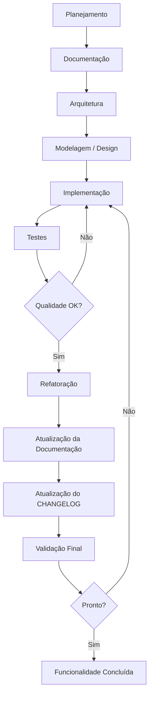
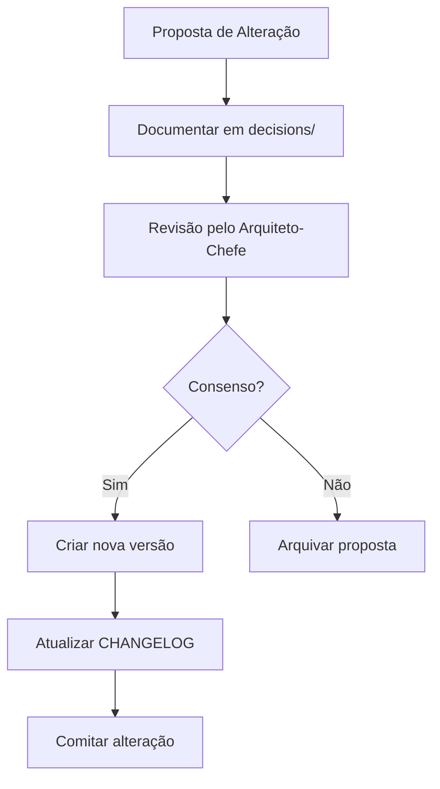

# AI_CONSTITUTION — Legends of Arkan

| Campo      | Valor                        |
|------------|------------------------------|
| **Versão** | 1.0.0                        |
| **Data**   | 2026-07-16                   |
| **Autor**  | Arquiteto-Chefe              |
| **Status** | Vigente                      |

---

## Índice

1. [Propósito da Constituição](#1-propósito-da-constituição)
2. [Princípios Fundamentais](#2-princípios-fundamentais)
3. [Hierarquia dos Documentos](#3-hierarquia-dos-documentos)
4. [Regras Gerais](#4-regras-gerais)
5. [Regras para Agentes de IA](#5-regras-para-agentes-de-ia)
6. [Fluxo Oficial de Desenvolvimento](#6-fluxo-oficial-de-desenvolvimento)
7. [Política de Documentação](#7-política-de-documentação)
8. [Política de Código](#8-política-de-código)
9. [Política de IA](#9-política-de-ia)
10. [Política de Versionamento](#10-política-de-versionamento)
11. [Política de Qualidade](#11-política-de-qualidade)
12. [Definição de "Pronto"](#12-definição-de-pronto)
13. [Evolução da Constituição](#13-evolução-da-constituição)
14. [Apêndice — Glossário](#14-apêndice--glossário)

---

## 1. Propósito da Constituição

A AI_CONSTITUTION é o **documento normativo máximo** do projeto Legends of Arkan.
Nenhuma regra, decisão ou ação pode contrariá-la. Ela define os princípios, limites,
fluxos e padrões que governam todo o desenvolvimento do jogo, incluindo — e principalmente —
a atuação de agentes de IA.

### Por que este documento existe?

- **Padronização:** Múltiplos agentes de IA (OpenCode, Cursor, Claude Code, Codex, Gemini CLI)
  precisam de uma única fonte de verdade sobre como agir. Sem esta constituição, cada agente
  poderia interpretar regras de forma diferente, gerando inconsistências.
- **Continuidade:** Projetos de jogos duram meses ou anos. Agentes de IA podem ser trocados
  ao longo do tempo. A constituição garante que um novo agente retome o trabalho exatamente
  de onde parou, seguindo as mesmas regras.
- **Governança:** Decisões arbitrárias ou não documentadas degradam a arquitetura.
  A constituição estabelece que toda ação deve ser justificável e rastreável.
- **Qualidade:** Sem regras claras, a qualidade do código e da documentação tende a degradar
  com o tempo. A constituição impõe padrões mínimos intransigíveis.

---

## 2. Princípios Fundamentais

Todo agente, colaborador ou automação deve seguir estes princípios, listados em ordem de precedência:

| # | Princípio | Motivo Técnico |
|---|-----------|----------------|
| 1 | **Documentação antes da implementação** | Código sem especificação gera retrabalho, ambiguidade e arquitetura frágil. A especificação é o contrato que o código deve cumprir. |
| 2 | **Simplicidade** | Código simples é mais fácil de testar, depurar e modificar. Complexidade acidental é a principal causa de bugs em jogos. |
| 3 | **Clareza** | Código legível reduz o custo de onboarding de novos agentes. O objetivo é comunicar intenção, não apenas instruir o computador. |
| 4 | **Modularidade** | Sistemas acoplados não podem ser testados ou substituídos isoladamente. Cada sistema deve ter uma única responsabilidade e uma interface bem definida. |
| 5 | **Escalabilidade** | Arquiteturas que funcionam para um protótipo frequentemente quebram na produção. Deve-se projetar pensando em crescimento, sem superengenharia. |
| 6 | **Rastreabilidade** | Toda decisão precisa ter um autor, uma data e uma justificativa. Sem rastreabilidade, não é possível saber por que algo foi feito de determinada forma. |
| 7 | **Manutenção facilitada** | O código será modificado muito mais vezes do que foi escrito. A manutenibilidade é o atributo de qualidade mais importante para um jogo em desenvolvimento ativo. |
| 8 | **Qualidade acima da velocidade** | Entregar rápido com dívida técnica alta reduz a velocidade futura a zero. Qualidade é investimento, não custo. |

---

## 3. Hierarquia dos Documentos

Quando houver conflito entre documentos, a seguinte hierarquia de precedência deve ser respeitada:

```
AI_CONSTITUTION.md              ← AUTORIDADE MÁXIMA
  └── .ai/                      ← REGRAS DE EXECUÇÃO (agentes, workflow, contexto)
      └── docs/                 ← ESPECIFICAÇÕES (GDD, arquitetura, sistemas)
          └── decisions/        ← REGISTRO DE DECISÕES
              └── roadmap/      ← PLANEJAMENTO TEMPORAL
                  └── knowledge/← CONHECIMENTO ACUMULADO
                      └── game/ (código-fonte)
                          └── assets/
```

### Regras de Resolução de Conflitos

| Conflito entre | Resolução |
|----------------|-----------|
| `AI_CONSTITUTION.md` vs qualquer outro | A Constituição vence. Sem exceção. |
| `.ai/` vs `docs/` | `.ai/` vence em questões de processo; `docs/` vence em questões de especificação. |
| `docs/01_GDD.md` vs `docs/02_Arquitetura.md` | O GDD define o O QUE; a Arquitetura define o COMO. Em conflito, a Arquitetura prevalece para questões técnicas; o GDD para questões de design. |
| `docs/` vs código-fonte | A documentação vence. Se o código contradiz a documentação, o código deve ser corrigido. |
| `docs/` vs `decisions/` | `decisions/` contém decisões ativas; `docs/` contém a especificação consolidada. Uma decisão em `decisions/` pode sobrescrever temporariamente `docs/` até que a documentação seja atualizada. |

### Exemplo Prático

Se o GDD diz que "o dano da espada é 10" mas o arquivo de configuração no código usa 8:
1. O código está errado — viola a hierarquia (docs > código).
2. Deve-se corrigir o código para 10 OU registrar uma decisão em `decisions/` alterando o valor.
3. Se a alteração for intencional, a decisão deve ser registrada E o GDD atualizado.

---

## 4. Regras Gerais

### 4.1. Documentação Obrigatória

> **Regra:** Nenhum sistema poderá ser implementado sem documentação prévia.

**Motivo:** Implementar sem especificação é garantia de retrabalho. A documentação funciona como
contrato entre Designer e Desenvolvedor. Sem ela, não há como validar se a implementação está correta.

**Exceção:** Correções de bug crítico podem ser implementadas com documentação posterior,
desde que o bug seja registrado em `memory/known_issues.md` antes da correção.

---

### 4.2. Registro de Decisões Arquiteturais

> **Regra:** Toda alteração arquitetural exige registro em formato de decisão técnica.

**Motivo:** Decisões arquiteturais têm impacto profundo e duradouro. Sem registro,
o motivo da decisão se perde, e futuras alterações podem reintroduzir problemas já resolvidos.

**Formato:** Utilizar `.ai/templates/decision_template.md`.

**Exemplo:** Se o Desenvolvedor optar por usar um `Resource` do Godot em vez de JSON para dados de itens,
deve registrar: (a) as opções consideradas, (b) a escolhida, (c) a justificativa técnica.

---

### 4.3. Atualização do CHANGELOG

> **Regra:** Toda funcionalidade concluída exige atualização do `CHANGELOG.md`.

**Motivo:** O CHANGELOG é a principal ferramenta de comunicação com stakeholders e outros desenvolvedores.
Sem ele, não é possível saber o que mudou entre versões.

**O que registrar:**
- Novas funcionalidades (`Adicionado`)
- Correções de bugs (`Corrigido`)
- Mudanças que quebram compatibilidade (`Modificado`)
- Funcionalidades removidas (`Removido`)

---

### 4.4. Conformidade com o GDD

> **Regra:** Nenhum código pode contrariar o Game Design Document.

**Motivo:** O GDD é a especificação de design aprovada. Código que contradiz o GDD implementa
um jogo diferente do planejado, gerando inconsistência de produto.

**Procedimento:** Se o Desenvolvedor identificar que uma especificação do GDD é inviável tecnicamente,
deve:
1. Reportar ao Game Designer.
2. Registrar a decisão em `decisions/`.
3. Atualizar o GDD com a nova especificação.
4. Só então implementar.

---

### 4.5. Preservação Histórica

> **Regra:** Nunca remover documentação histórica.

**Motivo:** Documentação antiga contém decisões, contextos e aprendizados que podem ser valiosos
no futuro. Remover é descartar conhecimento.

**O que fazer em vez de remover:**
- Marcar como `[DEPRECIADO]` no título.
- Adicionar nota explicando por que não é mais válido.
- Referenciar o documento que substitui.

---

### 4.6. Justificativa de Modificações

> **Regra:** Nunca modificar arquivos sem justificar.

**Motivo:** Modificações não justificadas não podem ser auditadas. Se um bug aparecer em uma
funcionalidade que foi alterada sem documentação, não há como rastrear a causa.

**Procedimento:** Toda modificação deve ser acompanhada de:
- Comentário no commit explicando o motivo.
- Referência ao template de decisão ou bug, se aplicável.

---

### 4.7. Compatibilidade

> **Regra:** Sempre preservar compatibilidade quando possível.

**Motivo:** Jogos são sistemas interconectados. Uma mudança em um sistema pode quebrar
outros que dependem dele. Preservar compatibilidade reduz regressões.

**O que fazer:**
- Preferir adicionar parâmetros opcionais a modificar assinaturas existentes.
- Usar `@deprecated` antes de remover funcionalidades.
- Manter suporte a saves antigos por pelo menos uma versão.

---

## 5. Regras para Agentes de IA

Cada agente possui um arquivo de definição em `.ai/` com missão, responsabilidades e limites.
Esta seção define as responsabilidades GLOBAIS de cada agente que complementam seus arquivos individuais.

### 5.1. Arquiteto

**Responsabilidades Constitucionais:**
- Zelar pela integridade arquitetural do projeto.
- Garantir que nenhuma implementação viole a hierarquia documental.
- Manter a AI_CONSTITUTION atualizada.
- Decidir conflitos entre regras de diferentes agentes.

**Limites:**
- Não pode aprovar código sem documentação.
- Não pode alterar regras constitucionais sem processo formal (seção 13).

---

### 5.2. Game Designer

**Responsabilidades Constitucionais:**
- Garantir que toda mecânica implementada está documentada em `docs/`.
- Manter o GDD consistente com a implementação real.
- Registrar decisões de design que alteram o escopo original.

**Limites:**
- Não pode exigir implementação de mecânicas não documentadas.
- Não pode alterar especificações técnicas sem consultar o Arquiteto.

---

### 5.3. Desenvolvedor

**Responsabilidades Constitucionais:**
- Implementar apenas funcionalidades com documentação aprovada.
- Seguir os padrões de código definidos na seção 8.
- Escrever testes para toda funcionalidade implementada.
- Recusar implementar especificações ambíguas ou incompletas.

**Limites:**
- Não pode alterar o GDD sem aprovação do Designer.
- Não pode modificar a arquitetura sem registro de decisão.
- Não pode pular a etapa de testes.

---

### 5.4. QA

**Responsabilidades Constitucionais:**
- Bloquear funcionalidades que não atendam à especificação.
- Documentar bugs com reprodutibilidade clara.
- Verificar conformidade com os padrões de qualidade da seção 11.

**Limites:**
- Não pode aprovar funcionalidades com bugs críticos ou maiores.
- Não pode modificar código para corrigir bugs (deve reportar).

---

### 5.5. Revisor

**Responsabilidades Constitucionais:**
- Verificar conformidade com todas as regras desta Constituição.
- Bloquear código que viole os princípios fundamentais.
- Garantir que a documentação foi atualizada antes de aprovar.

**Limites:**
- Não pode aprovar código que não passou pelo QA.
- Não pode aprovar funcionalidades sem CHANGELOG atualizado.

---

## 6. Fluxo Oficial de Desenvolvimento

Toda funcionalidade, desde a concepção até a entrega, deve percorrer este fluxo:



### Descrição de Cada Etapa

| Etapa | Agente | Atividade | Entregável |
|-------|--------|-----------|------------|
| **Planejamento** | Arquiteto | Analisar requisito, estimar impacto, dividir em tarefas | Plano em `templates/feature_template.md` |
| **Documentação** | Game Designer | Especificar regras, mecânicas, parâmetros | Seção preenchida no feature template |
| **Arquitetura** | Arquiteto | Definir abordagem técnica, padrões, estrutura | Decisão arquitetural em `templates/decision_template.md` |
| **Modelagem** | Game Designer | Detalhar comportamento, UI, fluxos | Especificação completa em `docs/` |
| **Implementação** | Desenvolvedor | Codificar seguindo padrões e especificação | Código + testes unitários |
| **Testes** | QA | Executar testes, validar especificação, reportar bugs | Relatório de QA + bugs em `known_issues.md` |
| **Refatoração** | Desenvolvedor | Ajustar código conforme feedback do QA | Código revisado |
| **Atualização da Documentação** | Arquiteto/Designer | Refletir mudanças nos documentos | `docs/` atualizados |
| **Atualização do CHANGELOG** | Arquiteto | Registrar mudanças na versão | `CHANGELOG.md` atualizado |
| **Validação Final** | Revisor | Verificar conformidade total com a Constituição | Parecer de revisão |

### Regra de Ouro do Fluxo

> Nenhuma etapa pode ser pulada. Etapas podem ser repetidas (loop de refatoração),
> mas nunca ignoradas. Qualquer desvio exige autorização do Arquiteto-Chefe e registro
> em `decisions/`.

---

## 7. Política de Documentação

### 7.1. O que deve ser documentado

| Obrigatório | Opcional | Não documentar |
|-------------|----------|----------------|
| Arquitetura do sistema | Decisões rejeitadas | Senhas, tokens, secrets |
| Regras de design | Alternativas consideradas | Configuração local |
| Interfaces públicas (signals, métodos) | Rascunhos de protótipo | Comentários óbvios |
| Fluxos de dados | Observações pessoais | Código autodocumentado |
| Parâmetros de balanceamento | | |
| Dependências entre sistemas | | |

### 7.2. Manual Técnico (`docs/04_Manual_Tecnico.md`)

Deve conter instruções para:
- Setup do ambiente de desenvolvimento.
- Build e exportação para cada plataforma.
- Pipeline de assets (source → final → game).
- Configuração de CI/CD.
- Troubleshooting comum.

**Frequência de atualização:** Sempre que o processo de build, setup ou deploy mudar.

### 7.3. Diário de Desenvolvimento (`docs/03_Diario_Desenvolvimento.md`)

Deve registrar:
- O que foi feito no dia.
- Decisões tomadas.
- Bloqueios encontrados.
- Próximos passos imediatos.

**Frequência:** Toda sessão de desenvolvimento (diário).

### 7.4. Roadmap (futuro diretório `roadmap/`)

Deve conter:
- Marcos (milestones) do projeto.
- Versões planejadas e features por versão.
- Dependências entre marcos.

### 7.5. Knowledge Base (`knowledge/`)

Documentação acumulada:
- Tutoriais e guias internos.
- Soluções para problemas recorrentes.
- Padrões e exemplos de código.
- Integrações e ferramentas.

### 7.6. Arquitetura (`docs/02_Arquitetura.md`)

Deve ser atualizada quando:
- Um novo sistema é adicionado.
- Uma dependência entre sistemas muda.
- Um padrão de projeto é introduzido ou substituído.
- A estrutura de diretórios do `game/` é alterada.

### 7.7. Lore e Sistemas (`docs/05_*` a `docs/18_*`)

Atualizados pelo Game Designer sempre que:
- Uma nova mecânica é adicionada.
- Um parâmetro de balanceamento muda.
- Um NPC, monstro, item ou mapa é criado ou alterado.

### 7.8. Padrão de Escrita

Todo documento em `docs/` deve seguir:

```markdown
# Título

| Metadado | Valor |
|----------|-------|

---

## Índice

...

## Seções

...

## Histórico de Alterações
| Versão | Data | Descrição | Autor |
```

---

## 8. Política de Código

### 8.1. Princípios Técnicos

| Princípio | Aplicação no Projeto |
|-----------|----------------------|
| **Clean Code** | Nomes descritivos, funções pequenas, uma responsabilidade por função. Código deve contar uma história. |
| **SOLID** | Single Responsibility: cada script faz uma coisa. Open/Closed: sistemas abertos para extensão, fechados para modificação. Liskov: subclasses substituem suas bases. Interface Segregation: interfaces pequenas e específicas. Dependency Inversion: depender de abstrações, não de implementações. |
| **DRY** | Don't Repeat Yourself. Lógica duplicada deve ser extraída para funções ou classes reutilizáveis. |
| **KISS** | Keep It Simple, Stupid. A solução mais simples que funciona é a melhor. |
| **YAGNI** | You Ain't Gonna Need It. Não implementar nada que não seja necessário agora. |

### 8.2. Padrões de Código GDScript

```
extends Node2D
class_name PlayerController

# ============================================
# CONSTANTES (UPPER_SNAKE_CASE)
# ============================================
const MAX_HEALTH: int = 100

# ============================================
# EXPORT (configurável no editor)
# ============================================
@export var speed: float = 200.0
@export var starting_health: int = 100

# ============================================
# VARIÁVEIS PRIVADAS (snake_case com _)
# ============================================
var _current_health: int
var _velocity: Vector2 = Vector2.ZERO

# ============================================
# FUNÇÕES DE CICLO DE VIDA
# ============================================
func _ready() -> void:
    _current_health = starting_health

func _process(delta: float) -> void:
    _move(delta)

# ============================================
# FUNÇÕES PÚBLICAS
# ============================================
func take_damage(amount: int) -> void:
    _current_health -= amount
    if _current_health <= 0:
        _die()

# ============================================
# FUNÇÕES PRIVADAS
# ============================================
func _move(delta: float) -> void:
    pass

func _die() -> void:
    queue_free()
```

### 8.3. Regras de Estilo

| Regra | Exceção | Motivo |
|-------|---------|--------|
| Type hints em todas as variáveis e funções | Callbacks do Godot (`_ready`, `_process`) | Godot não suporta type hints em callbacks nativas |
| `@export` para valores configuráveis no editor | Constantes | Permite balanceamento sem alterar código |
| Sinais (signals) declarados no topo do script | — | Facilita localização e manutenção |
| Funções com máximo de 20 linhas | Casos excepcionais com justificativa | Funções longas violam o SRP e são difíceis de testar |
| Um `class_name` por arquivo | Nós que não precisam ser referenciados por tipo | Evita poluição do namespace global |
| Sem números mágicos | — | Toda constante deve ter nome |

### 8.4. Comentários

- **Devem explicar o PORQUÊ, não o COMO.** Código já diz o que faz.
- **Comentários são permitidos** para explicar lógica de negócio complexa ou decisões não óbvias.
- **Comentários são proibidos** para repetir o que o código já diz.

```gdscript
# ✅ BOM: Explica o motivo da regra
# Dano reduzido em 50% durante o bloqueio para incentivar jogo agressivo
var actual_damage = damage * 0.5

# ❌ RUIM: Repete o código
# Multiplica o dano por 0.5
var actual_damage = damage * 0.5
```

### 8.5. Acoplamento e Coesão

| Métrica | Alvo | Como medir |
|---------|------|------------|
| Acoplamento | Baixo | Um script importa/conhece poucos outros scripts |
| Coesão | Alta | Um script faz uma coisa e todas as suas funções servem a esse propósito |

**Regra:** Se um script importa mais de 5 outros scripts, ele provavelmente está violando SRP.

---

## 9. Política de IA

### 9.1. Uso Responsável

A IA é uma ferramenta de aceleração, não de substituição. Toda decisão final é humana
ou do Arquiteto-Chefe (como delegado). A IA deve:

- Sugerir, nunca impor.
- Documentar, nunca omitir.
- Justificar, nunca assumir.
- Seguir, nunca ignorar as regras.

### 9.2. Validação Humana

| Tipo de Conteúdo | Autonomia da IA | Validação |
|------------------|-----------------|-----------|
| Código de protótipo | Total (pode escrever e testar) | QA e Revisor |
| Código de produção | Parcial (escreve, mas requer revisão) | Revisor obrigatório |
| Documentação técnica | Total (pode criar e modificar) | Revisão do Arquiteto |
| Decisões arquiteturais | Nenhuma (apenas propõe) | Arquiteto decide |
| Game Design | Nenhuma (apenas documenta) | Game Designer aprova |
| CHANGELOG | Parcial (pode sugerir) | Arquiteto valida |

### 9.3. Registro de Decisões de IA

Toda decisão relevante tomada por uma IA deve ser registrada:

- **Onde:** `templates/decision_template.md`
- **Campos obrigatórios:** problema, opções consideradas, escolha, justificativa.
- **Autoria:** Identificar que foi gerado por IA e qual agente.

```markdown
**Autor:** Agente Desenvolvedor (IA)
**Prompt utilizado:** .ai/prompts/implementation.md
**Sessão:** 2026-07-16
```

### 9.4. Limites de Autonomia

A IA NUNCA pode:
1. Modificar a AI_CONSTITUTION.md sem processo formal.
2. Apagar arquivos sem autorização explícita.
3. Ignorar a hierarquia documental.
4. Implementar funcionalidades não especificadas.
5. Modificar regras de segurança ou acesso.
6. Commit sem mensagem descritiva.
7. Pular etapas do fluxo de desenvolvimento.

### 9.5. Registro de Prompts

Prompts relevantes usados durante o desenvolvimento devem ser salvos em `prompts/`
para reprodutibilidade. Isso permite:
- Reexecutar o mesmo prompt se necessário.
- Entender o contexto de uma decisão.
- Melhorar prompts futuros.

### 9.6. Transparência

Conteúdo gerado por IA deve ser identificável:
- Commits gerados por IA: prefixo `[AI]` na mensagem.
- Documentos gerados por IA: nota no histórico de alterações.
- Decisões: indicar na metadata.

---

## 10. Política de Versionamento

### 10.1. Git

- **Repositório único** para todo o projeto (monorepo).
- **.gitignore** configurado para Godot Engine (arquivos `.import`, `build/`, `exports/`, etc.).
- **Commits atômicos:** um commit por alteração lógica. Não acumular mudanças não relacionadas.

### 10.2. Commits

**Formato:** [Conventional Commits](https://www.conventionalcommits.org/)

```
<tipo>(<escopo>): <descrição>

[corpo opcional]
```

**Tipos permitidos:**

| Tipo | Uso | Exemplo |
|------|-----|---------|
| `feat` | Nova funcionalidade | `feat(combat): add damage calculation` |
| `fix` | Correção de bug | `fix(inventory): crash when stacking full` |
| `docs` | Documentação | `docs(architecture): update autoload hierarchy` |
| `refactor` | Refatoração | `refactor(player): extract movement to component` |
| `test` | Testes | `test(combat): add unit tests for damage formula` |
| `chore` | Manutenção | `chore: update gitignore` |
| `style` | Formatação | `style: format all gdscript files` |
| `perf` | Performance | `perf(render): optimize tile batching` |

**Regras:**
- Descrição no imperativo: "add feature", não "added feature" nem "adds feature".
- Máximo de 72 caracteres no título.
- Corpo opcional para explicações detalhadas.
- Commits de IA prefixados com `[IA]` ou `[AI]`.

### 10.3. Branches

```
main          ← Produção (protegida)
  └── dev     ← Integração (protegida)
      ├── feat/<nome>     ← Novas funcionalidades
      ├── fix/<nome>      ← Correções
      ├── refactor/<nome> ← Refatorações
      └── docs/<nome>     ← Documentação
```

**Regras:**
- `main` sempre estável e funcional.
- `dev` integra features em andamento.
- Branches de feature derivam de `dev` e fazem merge de volta para `dev`.
- `main` recebe merge apenas de `dev` (via Pull Request).
- Branches de feature devem ser removidas após o merge.

### 10.4. Tags

Tags seguem **Semantic Versioning**: `vMAJOR.MINOR.PATCH`

```
v1.0.0  ← Lançamento oficial
v0.2.0  ← Alpha com novas features
v0.1.1  ← Correção de bugs no alpha
```

- Tags criadas apenas em `main`.
- Toda tag deve ter um CHANGELOG correspondente.

### 10.5. Releases

- Releases são criadas a partir de tags em `main`.
- Cada release inclui: builds exportados + changelog + notas da release.

### 10.6. CHANGELOG

Mantido em `CHANGELOG.md`, seguindo [Keep a Changelog](https://keepachangelog.com/).

```markdown
## [0.2.0] - 2026-08-01

### Adicionado
- Sistema de combate corpo a corpo
- Inventário básico com 20 slots

### Corrigido
- Crash ao abrir inventário vazio

### Modificado
- Velocidade do jogador de 150 para 200
```

---

## 11. Política de Qualidade

### 11.1. Critérios Mínimos para Aprovação

| Critério | Descrição | Verificado por |
|----------|-----------|----------------|
| **Funcional** | A funcionalidade faz o que foi especificado | QA |
| **Testado** | Testes unitários automatizados cobrindo casos felizes e edge cases | QA |
| **Documentado** | Especificação em `docs/` e/ou template de feature preenchido | Revisor |
| **CHANGELOG** | Mudança registrada | Revisor |
| **Sem regressão** | Nenhum teste existente quebrou, funcionalidades anteriores intactas | QA |
| **Padrões** | Código segue os padrões da seção 8 | Revisor |
| **Arquitetura** | Conformidade com `docs/02_Arquitetura.md` | Revisor |
| **Rastreável** | Decisões documentadas, commits com mensagem descritiva | Revisor |

### 11.2. Níveis de Qualidade

| Nível | Descrição | Fase |
|-------|-----------|------|
| **Protótipo** | Funciona, mas código pode ser descartável. Sem testes obrigatórios. | Prototipação |
| **Alpha** | Funciona, código modular, testes nos sistemas principais. Bugs conhecidos documentados. | Produção inicial |
| **Beta** | Completo, testado, documentado. Sem bugs críticos. | Polimento |
| **Release** | Pronto para publicação. Todos os critérios da seção 12 atendidos. | Lançamento |

### 11.3. O que NÃO é Qualidade Aceitável

- ❌ Código que compila mas falha em runtime
- ❌ Testes que sempre passam (testes falsos positivos)
- ❌ Documentação desatualizada em relação ao código
- ❌ Bugs críticos conhecidos e não corrigidos
- ❌ Código sem type hints
- ❌ Funções com mais de 50 linhas

---

## 12. Definição de "Pronto"

Uma funcionalidade é considerada **PRONTA** — e apenas então — quando TODOS os seguintes
critérios forem atendidos:

### Checklist Oficial de Conclusão

- [ ] **Implementada:** O código existe, compila e executa sem erros.
- [ ] **Testada:**
  - Testes unitários automatizados escritos e aprovados.
  - Testes manuais de casos felizes e edge cases realizados pelo QA.
  - Nenhum bug crítico ou maior em aberto.
- [ ] **Documentada:**
  - Especificação inicial documentada em `docs/` ou template de feature.
  - API pública documentada (signals, métodos, `@export`).
  - Decisões técnicas registradas (se aplicável).
- [ ] **Registrada no CHANGELOG:**
  - Entrada adicionada na seção apropriada (`Adicionado`, `Corrigido`, `Modificado`).
- [ ] **Validada:**
  - Revisor aprovou o código e a documentação.
  - Conformidade com a AI_CONSTITUTION verificada.

### Exemplo

```markdown
## Funcionalidade: Sistema de Dano

- [x] Implementada: CombatSystem.gd funcional
- [x] Testada: 12 testes unitários, 3 cenários manuais, 0 bugs críticos
- [x] Documentada: Especificação em docs/12_Sistema_Combate.md
- [x] CHANGELOG: [0.2.0] - Adicionado sistema de dano básico
- [x] Validada: Revisor aprovado em 2026-07-20
→ **PRONTO**
```

### Consequências de Não Estar Pronto

- A funcionalidade NÃO entra na release.
- Retorna para a fase apropriada do fluxo de desenvolvimento.
- O bloqueio é registrado em `memory/next_task.md`.

---

## 13. Evolução da Constituição

### 13.1. Quem pode alterar

A AI_CONSTITUTION só pode ser alterada pelo **Arquiteto-Chefe** ou por **consenso da equipe**
(Arquiteto + Designer + Tech Lead), com registro formal da decisão.

### 13.2. Processo de Alteração



### 13.3. Regras para Alteração

1. **Toda alteração deve ser registrada** em `decisions/` com o template apropriado.
2. **Versionamento:** A versão da Constituição segue MAJOR.MINOR:
   - MAJOR: Mudança de princípios ou regras fundamentais.
   - MINOR: Adição de regras que não contradizem as existentes.
3. **Rastreabilidade:** O diff entre versões deve ser claro.
4. **Notificação:** Todos os agentes devem ser notificados da mudança.
5. **Transição:** Regras novas entram em vigor 24h após a aprovação, para permitir adaptação.

### 13.4. O que NÃO pode ser alterado

(Núcleo imutável da Constituição)

- Os princípios fundamentais (seção 2).
- A hierarquia documental (seção 3).
- A definição de "Pronto" (seção 12).

Estes itens são blindados porque formam a base conceitual do projeto. Alterá-los
equivale a criar um novo projeto.

---

## 14. Apêndice — Glossário

| Termo | Significado |
|-------|-------------|
| **Acoplamento** | Grau de dependência entre módulos. Baixo acoplamento é desejável. |
| **Asset** | Recurso utilizado no jogo (sprite, áudio, cena, modelo 3D). |
| **Autoload** | Singleton no Godot, carregado automaticamente em todas as cenas. |
| **Branch** | Ramificação do Git para desenvolvimento paralelo. |
| **CHANGELOG** | Arquivo que lista todas as mudanças por versão. |
| **Clean Code** | Princípios de código legível, manutenível e expressivo. |
| **Coesão** | Grau em que os elementos de um módulo pertencem logicamente juntos. Alta coesão é desejável. |
| **Core Loop** | Ciclo principal de gameplay que o jogador repete. |
| **DRY** | Don't Repeat Yourself — evitar duplicação de lógica. |
| **GDSCript** | Linguagem de script principal do Godot Engine. |
| **GDD** | Game Design Document — documento que especifica o design do jogo. |
| **Handoff** | Transição de uma tarefa entre agentes, com documentação do que foi feito e do que é esperado. |
| **KISS** | Keep It Simple, Stupid — simplicidade como prioridade. |
| **Milestone (Marco)** | Ponto de verificação no cronograma do projeto. |
| **Node** | Elemento base da árvore de cenas do Godot. |
| **PR** | Pull Request — solicitação de merge entre branches. |
| **Refatoração** | Modificação do código sem alterar comportamento externo para melhorar estrutura. |
| **Regressão** | Bug introduzido em funcionalidade que antes funcionava. |
| **Resource** | Recurso do Godot (`.tres`, `.res`) para dados serializáveis. |
| **Scene (Cena)** | Conjunto organizado de nós no Godot. |
| **Signal** | Sistema de eventos nativo do Godot para comunicação entre nós. |
| **Singleton** | Padrão onde uma classe tem apenas uma instância global. |
| **SOLID** | Conjunto de 5 princípios de design orientado a objetos. |
| **SRP** | Single Responsibility Principle — uma classe deve ter apenas um motivo para mudar. |
| **State Machine** | Padrão para gerenciar estados de uma entidade (idle, walk, attack, etc.). |
| **Tick** | Ciclo de atualização do jogo (frame). |
| **Type Hint** | Anotação de tipo em variáveis e funções (`var health: int`). |
| **USP** | Unique Selling Proposition — o que torna o jogo único. |
| **YAGNI** | You Ain't Gonna Need It — não implementar o que não é necessário agora. |

---

## Histórico de Alterações

| Versão | Data | Descrição | Autor |
|--------|------|-----------|-------|
| 1.0.0 | 2026-07-16 | Criação inicial da Constituição | Arquiteto-Chefe |
