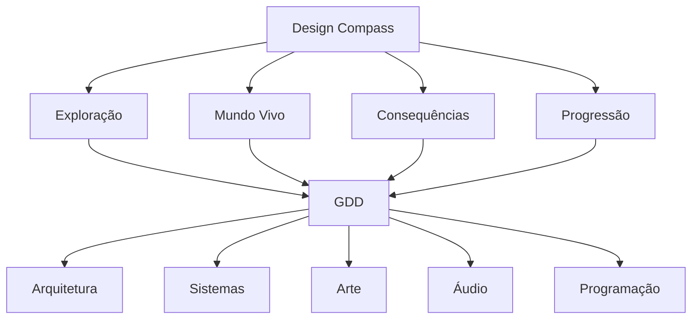

# Design Compass — Legends of Arkan

| Campo      | Valor                       |
|------------|-----------------------------|
| **Versão** | 1.0.0                       |
| **Data**   | 2026-07-16                  |
| **Autor**  | Diretor Criativo / Lead GD |
| **Status** | Vigente                     |

> *Consulte este documento antes de toda decisão importante de design, arte, narrativa ou sistemas.*

---

## Índice

1. [Propósito](#1-propósito)
2. [Visão Resumida do Jogo](#2-visão-resumida-do-jogo)
3. [Promessa ao Jogador](#3-promessa-ao-jogador)
4. [Fantasia do Jogador](#4-fantasia-do-jogador)
5. [Os Quatro Pilares do Design](#5-os-quatro-pilares-do-design)
6. [Princípios de Design](#6-princípios-de-design)
7. [O que o Jogo NÃO é](#7-o-que-o-jogo-não-é)
8. [Teste da Bússola](#8-teste-da-bússola)
9. [Frases Norteadoras](#9-frases-norteadoras)
10. [Evolução da Bússola](#10-evolução-da-bússola)

---

## 1. Propósito

A Design Compass é o **documento de identidade do jogo**. Ela define quem somos, o que fazemos e — igualmente importante — o que **não** fazemos.

Toda funcionalidade, todo sistema, toda peça de arte, toda nota musical deve passar por esta bússola. Se algo não aponta na mesma direção, não pertence a Legends of Arkan.

**Quando consultar:**
- Antes de projetar um novo sistema.
- Antes de criar um novo bioma ou inimigo.
- Quando houver dúvida entre duas abordagens de design.
- Quando uma funcionalidade proposta parecer "legal, mas não sei se encaixa".
- Durante toda revisão de design (QA e Revisor devem ter esta bússola aberta).

---

## 2. Visão Resumida do Jogo

Legends of Arkan é um **RPG 2D sistêmico** com forte foco em **exploração** e **mundo vivo**.

O jogador habita um mundo que existe independentemente dele — NPCs têm rotinas, a economia flutua, criaturas migram e estações mudam. As escolhas do jogador geram consequências reais e perceptíveis, criando histórias emergentes que tornam cada partida única.

A descoberta é o motor emocional do jogo. Novos biomas, receitas secretas, NPCs escondidos, chefes opcionais — tudo recompensa o jogador curioso. A pressa é inimiga da experiência.

> *Explore um mundo vivo. Faça escolhas que importam. Escreva sua própria lenda.*

---

## 3. Promessa ao Jogador

> **"Em Arkan, o mundo não espera por você — mas ele lembra de cada passo seu."**

**Por que alguém jogaria Legends of Arkan?** Porque oferece algo raro em jogos 2D: um mundo que **reage**, **evolui** e **registra** a passagem do jogador. Cada decisão — craftar uma espada ou um arco, ajudar uma facção ou ignorá-la, explorar uma caverna ou seguir o caminho principal — deixa uma marca permanente no mundo.

---

## 4. Fantasia do Jogador

O jogador de Legends of Arkan se sente como **um aventureiro em um mundo vasto e indiferente que gradualmente se torna uma lenda viva**.

### Experiência emocional desejada

| Fase do Jogo | Sensação | Como se sente |
|-------------|----------|---------------|
| **Início** | Vulnerabilidade | "Sou frágil, desconhecido, e o mundo é perigoso." |
| **Meio** | Descoberta | "Cada curva revela algo novo. Estou aprendendo as regras deste mundo." |
| **Final** | Maestria + Pertencimento | "Conheço este mundo, e ele me conhece. Minhas ações têm peso." |

### O que NÃO queremos

- O herói escolhido que salva o mundo porque o destino assim determinou.
- O jogador é apenas mais um habitante de Arkan que, através de suas ações, **torna-se** alguém importante.

---

## 5. Os Quatro Pilares do Design

### Pilar 1 — Exploração

| Aspecto | Diretriz |
|---------|----------|
| **Definição** | O ato de descobrir o mundo é a atividade central do jogo. |
| **Como fazer** | Mapas abertos com múltiplas entradas, segredos visíveis mas de acesso não óbvio, recompensas fora do caminho principal. |
| **O que evitar** | Corredores lineares, minimapa que revela tudo, waypoints que guiam o jogador passo a passo. |
| **Exemplo concreto** | Uma parede rachada não é um puzzle — é um convite. O jogador vê, lembra, e volta com a ferramenta certa. |

**Influência no design:** Todo bioma deve ter pelo menos 3 áreas secretas. Toda área secreta deve conter algo útil (receita, item, lore). Nenhuma recompensa importante deve estar no caminho óbvio.

---

### Pilar 2 — Mundo Vivo

| Aspecto | Diretriz |
|---------|----------|
| **Definição** | O mundo funciona independentemente do jogador. NPCs vivem suas vidas, criaturas se comportam conforme seu habitat, a economia se move. |
| **Como fazer** | NPCs com rotinas diárias, ciclos dia/noite que afetam comportamento, economia com oferta e demanda, estações climáticas. |
| **O que evitar** | NPCs que ficam parados no mesmo lugar 24h, lojas com estoque infinito, inimigos que spawnam no mesmo lugar sempre. |
| **Exemplo concreto** | O ferreiro fecha a loja ao entardecer e vai para casa. Se o jogador chegar depois do horário, precisa esperar até o dia seguinte ou arrombar a porta (com consequências). |

**Influência no design:** O estado do mundo persiste. Se o jogador matou todos os lobos de uma floresta, eles não reaparecem magicamente — a cadeia alimentar local se ajusta.

---

### Pilar 3 — Consequências

| Aspecto | Diretriz |
|---------|----------|
| **Definição** | Escolhas relevantes geram consequências perceptíveis e duradouras. |
| **Como fazer** | Sistema de reputação por facção, missões com múltiplas resoluções, economia que reage a ações do jogador, mudanças permanentes no mapa. |
| **O que evitar** | Escolhas falsas (duas opções que levam ao mesmo resultado), consequências puramente cosméticas, sistema de moralidade binário (bom vs mau). |
| **Exemplo concreto** | Ajudar uma facção dá acesso a itens exclusivos MAS fecha o acesso à facção rival. O jogador não pode farmar reputação com ambos. |

**Influência no design:** Missões principais têm pelo menos 2 resoluções possíveis. Missões secundárias têm consequências que afetam o estado do mundo. O jogo não "perdoa" escolhas — elas são permanentes.

---

### Pilar 4 — Progressão

| Aspecto | Diretriz |
|---------|----------|
| **Definição** | O jogador evolui de forma tangível e significativa. Cada novo item, habilidade ou conhecimento muda a forma como o jogo é jogado. |
| **Como fazer** | Itens que desbloqueiam novas formas de interagir com o mundo (e não apenas números maiores). Habilidades que abrem acesso a áreas antes inacessíveis. Crafting que permite criar soluções criativas. |
| **O que evitar** | Progressão puramente numérica (+5 de dano). Níveis que só aumentam estatísticas sem mudar gameplay. Itens que são upgrades diretos sem trade-offs. |
| **Exemplo concreto** | Uma picareta não é "dano +10" — é uma ferramenta que permite minerar paredes específicas, abrindo rotas alternativas. Um cajado não é "magia +15" — permite congelar superfícies para criar plataformas. |

**Influência no design:** Habilidades e itens desbloqueiam **novas formas de jogar**, não apenas números maiores. Cada upgrade deve mudar algo na interação jogador-mundo.

---

## 6. Princípios de Design

| # | Princípio | Justificativa |
|---|-----------|---------------|
| 1 | **O jogador deve ser recompensado pela curiosidade.** | Se desviar do caminho nunca vale a pena, o jogador aprende a seguir a rota ótima. A exploração morre. |
| 2 | **O mundo deve parecer independente do jogador.** | Se tudo no mundo só acontece quando o jogador chega, o mundo parece falso. NPCs precisam ter vidas próprias. |
| 3 | **Escolhas relevantes devem gerar consequências perceptíveis.** | Se a escolha não muda nada, não é uma escolha — é uma ilusão. O jogador percebe e perde confiança no jogo. |
| 4 | **A progressão deve ser constante e significativa.** | Longos períodos sem progresso são frustrantes. Progressão puramente numérica é entediante. Cada sessão precisa de pelo menos um momento de "evolui". |
| 5 | **O aprendizado deve ocorrer naturalmente.** | Tutoriais textuais quebram a imersão. O jogo deve ensinar pelas suas mecânicas — o jogador aprende fazendo, errando e descobrindo. |
| 6 | **A dificuldade deve vir da complexidade, não da estatística.** | Inimigos com mais HP e dano não são mais interessantes. Inimigos com novos padrões de ataque e interações com o ambiente são. |
| 7 | **A economia deve contar uma história.** | Preços não são apenas números — refletem oferta, demanda, eventos do mundo e ações do jogador. |
| 8 | **Nem tudo precisa ser explicado.** | Mistério é um recurso de design. Deixar perguntas sem resposta incentiva exploração e especulação. |

---

## 7. O que o Jogo NÃO é

| Não é | Por que está fora |
|-------|------------------|
| **MMORPG** | O jogo é single-player. Não há necessidade de balanceamento multiplayer, servidores ou infraestrutura online. O foco é a experiência individual. |
| **Jogo focado em PvP** | Não há combate entre jogadores. O conflito é jogador vs mundo (PvE). |
| **Jogo de missões repetitivas** | Missões são eventos únicos com começo, meio e fim. Sem "mate 10 lobos" como conteúdo principal. Missões repetitivas são opcionais e justificadas narrativamente (caça de recompensas, por exemplo). |
| **Exploração como deslocamento** | Explorar não é ir do ponto A ao ponto B. É descobrir o que existe entre A, B, C e além. Cada área contém descobertas, não apenas obstáculos. |
| **Jogo de ação puro** | Combate é parte da experiência, não o centro. O foco está na progressão sistêmica, não na habilidade de reflexo. |
| **Corredor linear** | O mundo não é um conjunto de fases. É um espaço contínuo com múltiplas direções e escolhas de caminho. |
| **Simulador de crafting** | Crafting é um meio, não o fim. Ele serve à progressão e à exploração, não é um jogo à parte. |

---

## 8. Teste da Bússola

Antes de implementar qualquer funcionalidade, sistema ou conteúdo novo, responda:

| # | Pergunta | Sim | Não |
|---|----------|:---:|:---:|
| 1 | Esta funcionalidade **incentiva a exploração**? | | |
| 2 | Ela **fortalece a sensação de mundo vivo**? | | |
| 3 | Ela permite ou gera **histórias emergentes**? | | |
| 4 | Ela oferece ao jogador **escolhas com consequências**? | | |
| 5 | Ela **enriquece a progressão** (não apenas numericamente)? | | |
| 6 | Ela torna a experiência **mais memorável**? | | |
| 7 | Ela respeita a **fantasia do jogador** (seção 4)? | | |
| 8 | Ela é algo que o jogo **se propõe a ser** (seção 7)? | | |

### Resultado

| Resultado | Ação |
|-----------|------|
| **7–8 "Sim"** | ✅ Implementar sem ressalvas |
| **5–6 "Sim"** | ⚠️ Implementar com atenção aos pontos fracos |
| **3–4 "Sim"** | 🔄 Reavaliar — a funcionalidade pode estar fora da identidade |
| **0–2 "Sim"** | ❌ Não implementar — pertence a outro projeto |

> *Se a maioria das respostas for "Não", a funcionalidade deve ser reavaliada ou descartada.*

---

## 9. Frases Norteadoras

Estas frases resumem a filosofia do projeto. Use-as como lembretes rápidos:

1. **"A curiosidade deve ser recompensada."** — Todo desvio do caminho principal deve valer a pena.
2. **"O mundo não espera pelo jogador."** — NPCs vivem, a economia flutua, o tempo passa.
3. **"Toda escolha deve deixar uma marca."** — Consequências são reais e permanentes.
4. **"O jogador cria sua própria história."** — Histórias emergentes são mais poderosas que histórias roteirizadas.
5. **"Explore, não corra."** — A pressa é inimiga da experiência. O jogo recompensa quem para e observa.
6. **"Progressão é transformação, não inflação."** — +5 de dano não é progressão. Uma nova habilidade que muda o gameplay é.
7. **"O mundo é feito de sistemas, não de roteiros."** — Sistemas interagem para gerar resultados imprevisíveis, não scripts fixos.
8. **"Mistério é um recurso de design."** — Nem tudo precisa ser explicado. Algumas perguntas ficam para o jogador responder.
9. **"Ferramentas, não chaves."** — Itens são ferramentas que resolvem problemas de formas criativas, não chaves que abrem portas específicas.
10. **"O jogador merece confiar no jogo."** — Se o jogo promete algo, ele entrega. Sem ilusões de escolha, sem sistemas que mentem.

---

## 10. Evolução da Bússola

A Design Compass é um **documento vivo**, mas sua alteração não é trivial.

### Quem pode alterar

- **Diretor Criativo** (responsável pelo documento)
- **Lead Game Designer** (com aprovação do Diretor Criativo)

### Processo de alteração

1. Proposta de alteração registrada em `templates/decision_template.md`.
2. Justificativa clara: o que mudou no projeto que exige esta alteração?
3. Aprovação do Diretor Criativo.
4. Documento atualizado com nova versão.
5. Notificação a todos os agentes.

### O que NÃO pode mudar

- Os quatro pilares (Exploração, Mundo Vivo, Consequências, Progressão).
- A promessa ao jogador.
- As frases norteadoras 1, 2 e 3 (são a identidade central).

Estes itens são blindados. Se precisarem mudar, o projeto mudou de identidade — e um novo Design Compass deve ser escrito do zero.

---

## Histórico de Alterações

| Versão | Data | Descrição | Autor |
|--------|------|-----------|-------|
| 1.0.0 | 2026-07-16 | Criação inicial do Design Compass | Diretor Criativo |
