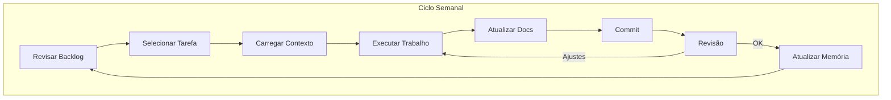
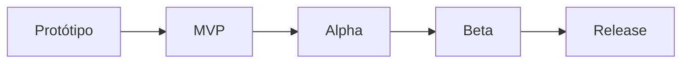

# Project Charter — Legends of Arkan

| Campo      | Valor                        |
|------------|------------------------------|
| **Versão** | 1.0.0                        |
| **Data**   | 2026-07-16                   |
| **Autor**  | Gerente de Projetos Sênior   |
| **Status** | Aprovado                     |

---

## Índice

1. [Identificação do Projeto](#1-identificação-do-projeto)
2. [Visão do Projeto](#2-visão-do-projeto)
3. [Missão](#3-missão)
4. [Objetivos](#4-objetivos)
5. [Escopo](#5-escopo)
6. [Público-Alvo](#6-público-alvo)
7. [Plataformas](#7-plataformas)
8. [Tecnologias](#8-tecnologias)
9. [Metodologia](#9-metodologia)
10. [Organização do Projeto](#10-organização-do-projeto)
11. [Stakeholders](#11-stakeholders)
12. [Critérios de Sucesso](#12-critérios-de-sucesso)
13. [Riscos](#13-riscos)
14. [Estratégia de Mitigação](#14-estratégia-de-mitigação)
15. [Roadmap Macro](#15-roadmap-macro)
16. [Critérios para Encerramento do Projeto](#16-critérios-para-encerramento-do-projeto)
17. [Princípios do Estúdio](#17-princípios-do-estúdio)

---

## 1. Identificação do Projeto

| Campo | Valor |
|-------|-------|
| **Nome do Projeto** | Legends of Arkan |
| **Nome Provisório** | LoA (sigla interna) |
| **Versão do Documento** | 1.0.0 |
| **Data de Criação** | 2026-07-16 |
| **Status** | Em Concepção |
| **Responsável** | Arquiteto-Chefe / Gerente de Projetos |
| **Tipo de Projeto** | Jogo 2D — desenvolvimento solo assistido por IA |
| **Engine** | Godot Engine 4.x |
| **Linguagem Principal** | GDScript 2.0 |
| **Plataforma Inicial** | Windows (Steam / itch.io) |
| **Licença** | MIT |
| **Orçamento** | Não aplicável (projeto de portfólio / aprendizado) |

---

## 2. Visão do Projeto

Legends of Arkan é um jogo 2D que combina **combate dinâmico**, **exploração de um mundo rico** e **sistemas de progressão baseados em crafting e economia**. A experiência é centrada na sensação de evolução constante: o jogador começa frágil e desarmado e, através de exploração, combate e criação, torna-se uma lenda viva no mundo de Arkan.

### A experiência que queremos proporcionar

- **Agência real:** As escolhas do jogador importam — o que craftar, onde explorar, como combater.
- **Progressão tangível:** Cada novo equipamento muda a forma como o jogo é jogado.
- **Mundo vivo:** NPCs com rotinas, economia que reage ao jogador, inimigos com comportamentos distintos.
- **Rejogabilidade:** Diferentes estilos de jogo (combate direto, furtividade, crafting) incentivam múltiplas jogatinas.

### O que torna este jogo diferente

A maioria dos jogos 2D com crafting trata o sistema como secundário. Em Legends of Arkan, **o crafting é o motor da progressão**. O jogador não apenas coleta recursos — ele **decide o que criar**, **escolhe entre qualidade e quantidade**, e **cada item criado muda sua abordagem ao mundo**.

### Identidade visual e temática

O jogo possui uma estética pixel art moderna, paleta rica por bioma e atmosfera que mescla **fantasia clássica com elementos de mistério**. O tom narrativo é de descoberta — o mundo já existia antes do jogador, e cabe a ele desvendar seus segredos.

---

## 3. Missão

Construir um jogo 2D completo, funcional e polido utilizando Godot Engine 4.x, seguindo práticas profissionais de estúdio com desenvolvimento assistido por IA, servindo como:

- **Portfólio técnico** demonstrando proficiência em Godot, GDScript, arquitetura de software e documentação.
- **Prova de conceito** de que um desenvolvedor solo + IA pode produzir software de qualidade profissional com a metodologia e ferramentas certas.
- **Base reutilizável** de templates, arquitetura e documentação para projetos futuros.

---

## 4. Objetivos

### Objetivos Técnicos

| # | Objetivo | Critério de Sucesso |
|---|----------|---------------------|
| T1 | Implementar arquitetura modular com baixo acoplamento | Cada sistema pode ser testado isoladamente |
| T2 | Alcançar cobertura de testes > 70% nos sistemas core | Relatório de cobertura |
| T3 | Manter performance estável (60 FPS) em hardware de entrada | Teste de performance documentado |
| T4 | Publicar builds para Windows e Web | Builds exportáveis e funcionais |
| T5 | Implementar pipeline de CI/CD básico | Build automático ao fazer merge na `main` |

### Objetivos Educacionais

| # | Objetivo | Critério de Sucesso |
|---|----------|---------------------|
| E1 | Dominar Godot Engine 4.x (cenas, sinais, resources, autoloads) | Projeto publicado |
| E2 | Aplicar princípios SOLID e Clean Code em GDScript | Código revisado e aprovado |
| E3 | Documentar todo o processo de desenvolvimento | `docs/` completo e atualizado |
| E4 | Desenvolver habilidade de orquestração de agentes de IA | Sistema de agentes funcional |

### Objetivos Comerciais

| # | Objetivo | Critério de Sucesso |
|---|----------|---------------------|
| C1 | Disponibilizar o jogo no itch.io | Página publicada com jogo jogável |
| C2 | Publicar na Steam (via Steam Direct) | Página na Steam com build funcional |
| C3 | Receber feedback de pelo menos 10 playtesters | Relatório de playtest consolidado |

### Objetivos de Portfólio

| # | Objetivo | Critério de Sucesso |
|---|----------|---------------------|
| P1 | Repositório GitHub organizado e documentado | README, licença, CI, docs completos |
| P2 | Game Design Document publicado | GDD navegável e completo |
| P3 | Post-mortem do projeto disponível | Documento de retrospectiva publicado |

---

## 5. Escopo

### O que DENTRO do escopo

- Jogador controlável com movimentação, combate e interação
- Mundo 2D com múltiplos biomas interconectados
- Sistema de inventário com categorias, pilha e equipamento
- Sistema de crafting com receitas, estações e qualidade
- Sistema de combate em tempo real (ataque, defesa, esquiva, habilidades)
- NPCs com diálogo e comércio
- Inimigos com IA baseada em state machine
- Sistema de missões (principais e secundárias)
- Economia com moedas, lojas e flutuação de preços
- Sistema de progressão (atributos, habilidades, equipamentos)
- Música e efeitos sonoros
- UI/UX completa (HUD, menus, inventário, crafting, diálogo)
- Suporte a pelo menos 2 plataformas (Windows + Web)

### O que FORA do escopo

- Multijogador (co-op, PvP, online)
- Suporte a consoles (Switch, PlayStation, Xbox)
- Localização para múltiplos idiomas (apenas português brasileiro)
- Loja de itens pagos (microtransações)
- Conteúdo gerado proceduralmente (mundos são pré-projetados)
- Suporte a VR/AR
- Editor de níveis integrado para o jogador
- Sistema de modding
- Cross-save entre plataformas
- Conquistas da Steam (postergado para pós-lançamento)

### Controle de Scope Creep

Toda sugestão de nova funcionalidade deve passar por:

```
Sugestão → Registro em .ai/memory/next_task.md
         → Análise de impacto (Arquiteto)
         → Aprovação (Game Designer)
         → Inclusão no roadmap
         → Documentação em docs/
         → Implementação
```

Nenhuma funcionalidade pode ser adicionada sem passar por este fluxo. Funcionalidades que não estão no escopo devem ser registradas em um **Backlog de Ideias** para versões futuras.

---

## 6. Público-Alvo

| Característica | Descrição |
|----------------|-----------|
| **Idade** | 14–35 anos |
| **Perfil** | Jogadores que apreciam jogos 2D com progressão profunda, crafting e exploração |
| **Preferências** | Jogos como Stardew Valley (crafting), Terraria (exploração), Dead Cells (combate), Moonlighter (economia) |
| **Plataformas** | PC (Windows), Web (itch.io) |
| **Estilo de Jogador** | Explorador / Conquistador / Craftsperson — jogadores que gostam de sistemas interconectados e progressão tangível |
| **Tempo de Sessão** | 30–90 minutos |
| **Nível de Dificuldade** | Médio — acessível mas com profundidade para mastery |
| **Idioma** | Português brasileiro |

---

## 7. Plataformas

| Plataforma | Lançamento | Prioridade | Observação |
|------------|------------|------------|------------|
| Windows (itch.io) | ✓ Planejado | Alta | Build principal, público mais amplo |
| Web (itch.io) | ✓ Planejado | Alta | Alcance máximo, sem instalação |
| Windows (Steam) | ◐ Planejado | Média | Depende de aceitação na Steam Direct |
| Linux | ◐ Possível | Baixa | Se houver demanda |
| macOS | ✗ Não planejado | — | Inviável sem hardware para testes |

### Estratégia de Publicação

```
itch.io (Alpha/Beta) → Feedback → Steam (Release)
```

O itch.io será usado como plataforma de distribuição durante o desenvolvimento (builds alfa e beta), permitindo playtesting e feedback. A Steam será alvo da versão final.

---

## 8. Tecnologias

### Motor e Linguagens

| Tecnologia | Versão | Função |
|------------|--------|--------|
| Godot Engine | 4.x | Motor de jogo principal |
| GDScript | 2.0 | Linguagem de script |
| Markdown | — | Documentação |

### Versionamento e CI/CD

| Tecnologia | Função |
|------------|--------|
| Git | Controle de versão |
| GitHub | Repositório remoto |
| GitHub Actions | CI/CD (planejado) |

### Ferramentas de Desenvolvimento

| Ferramenta | Uso |
|------------|-----|
| VS Code | Editor de código principal |
| Aseprite | Pixel art e sprites |
| Krita | Arte conceitual e texturas |
| Audacity | Edição de áudio |
| Bosca Ceoil | Composição musical |
| Tiled (ou similar) | Editor de mapas (se necessário) |
| GitKraken / SourceTree | Interface gráfica Git |

### Infraestrutura de IA

| Ferramenta | Função no Projeto |
|------------|-------------------|
| OpenCode | Agente principal de desenvolvimento |
| Claude Code / Cursor | Agentes complementares |
| GitHub Copilot | Assistência de código (se disponível) |

### Padrões

| Tecnologia | Função |
|------------|--------|
| Conventional Commits | Padrão de commits |
| Semantic Versioning | Versionamento |
| Keep a Changelog | Formato do CHANGELOG |

---

## 9. Metodologia

O projeto adota uma **adaptação de Scrum/Kanban para desenvolvedor solo assistido por IA**. O processo é leve o suficiente para não burocratizar o desenvolvimento, mas robusto o suficiente para manter qualidade e direção.

### Ciclo de Trabalho



### Papéis

| Papel | Quem Exerce | Responsabilidade |
|-------|-------------|------------------|
| **Product Owner** | Desenvolvedor humano | Define prioridades, visão, aceita/rejeita entregas |
| **Scrum Master** | IA Arquiteto | Garante que o processo é seguido, remove impedimentos |
| **Arquiteto** | IA Arquiteto | Decisões técnicas, padrões, integridade arquitetural |
| **Game Designer** | IA Designer | Especificações de design, balanceamento, regras |
| **Time de Desenvolvimento** | IA Desenvolvedor | Implementação |
| **QA** | IA QA | Testes, validação, relatório de bugs |
| **Revisor** | IA Revisor | Code review, conformidade com padrões |

### Rituais

| Ritual | Frequência | Participantes | Duração | Atividade |
|--------|------------|--------------|----------|-----------|
| **Planejamento** | A cada tarefa | PO + Arquiteto + Designer | 15 min | Definir próxima tarefa, critérios de aceitação |
| **Desenvolvimento** | Contínuo | Dev + QA + Revisor | — | Implementação seguindo fluxo de agentes |
| **Revisão Semanal** | Semanal | Todos | 30 min | Revisar o que foi feito, atualizar roadmap |
| **Retrospectiva** | Mensal | Todos | 30 min | O que funcionou, o que melhorar, ajustes no processo |

### Artefatos Gerados

| Artefato | Conteúdo | Atualização |
|----------|----------|-------------|
| Backlog (`next_task.md`) | Tarefas pendentes | Contínua |
| Estado Atual (`current_state.md`) | O que está acontecendo agora | Por tarefa |
| Concluídas (`completed_features.md`) | Funcionalidades entregues | Por tarefa |
| Roadmap | Marcos do projeto | Mensal |
| Documentação (`docs/`) | Especificações | Conforme necessário |

---

## 10. Organização do Projeto

| Diretório | Finalidade |
|-----------|------------|
| `.ai/` | Sistema de Agentes de IA — definições, prompts, templates, memória persistente do projeto |
| `.github/` | Workflows CI/CD, templates de issues e pull requests |
| `assets/` | Assets finais compilados (.png, .ogg, .tscn, .glb) prontos para uso no motor |
| `backups/` | Cópias de segurança do projeto (não versionados) |
| `build/` | Artefatos intermediários de build (não versionados) |
| `concept_art/` | Arte conceitual, estudos de personagens e cenários, storyboards |
| `decisions/` | Registro de decisões arquiteturais e de design (ADR — Architecture Decision Records) |
| `docs/` | Documentação completa do projeto — 20 documentos cobrindo todas as disciplinas |
| `exports/` | Builds finais exportadas para distribuição (não versionados) |
| `game/` | Projeto Godot — `project.godot`, cenas (`*.tscn`), scripts (`*.gd`), recursos (`*.tres`) |
| `knowledge/` | Base de conhecimento acumulada — soluções, tutoriais, guias internos |
| `prompts/` | Prompts de IA utilizados durante o desenvolvimento |
| `references/` | Referências visuais, técnicas e de design |
| `roadmap/` | Planejamento temporal, marcos, cronograma |
| `scripts/` | Scripts de automação para pipeline de assets, build, deploy |
| `source/` | Arquivos-fonte editáveis (.psd, .kra, .blend) |
| `tests/` | Testes automatizados (GDScript) |
| `tools/` | Ferramentas internas personalizadas |

---

## 11. Stakeholders

| Stakeholder | Papel | Interesse | Influência | Estratégia de Engajamento |
|-------------|-------|-----------|------------|---------------------------|
| **Desenvolvedor (Humano)** | Product Owner, decisor final | Qualidade, aprendizado, conclusão | Alta | Autonomia total sobre decisões |
| **IA Arquiteto** | Arquiteto de Software | Integridade arquitetural, padrões | Alta (consulta) | Diretrizes claras via `.ai/architect.md` |
| **IA Desenvolvedor** | Implementador | Código funcional e bem estruturado | Média | Especificações claras via templates |
| **IA Game Designer** | Designer | Experiência do jogador, balanceamento | Média | Design documentado em `docs/` |
| **IA QA** | Testador | Qualidade, ausência de bugs | Média | Relatórios de bug estruturados |
| **IA Revisor** | Revisor | Conformidade com padrões | Média | Checklists de revisão |
| **Jogadores (playtesters)** | Usuários finais | Experiência divertida e funcional | Baixa (feedback) | Builds alpha/beta públicas |
| **Comunidade (itch.io)** | Público | Jogo gratuito ou acessível | Baixa | Transparência no desenvolvimento |

---

## 12. Critérios de Sucesso

### Marcos do Projeto



| Marco | Definição | Critério de Aprovação |
|-------|-----------|----------------------|
| **P0 — Fundação** | Estrutura do projeto, documentos base, sistema de agentes | ✅ Projeto criado, documentos preenchidos, `.ai/` funcional |
| **P1 — Protótipo** | Core loop jogável em uma cena minimalista | ✅ Jogador se move, ataca, interage com um objeto |
| **P2 — MVP** | 1 bioma completo com exploração, combate, crafting básico | ✅ Ciclo completo jogável do início ao fim do bioma |
| **P3 — Alpha** | Todos os sistemas implementados, 50% do conteúdo | ✅ Sem crashes, todos os sistemas conectados |
| **P4 — Beta** | Conteúdo completo, balanceamento inicial | ✅ Jogável do início ao fim, bugs conhecidos documentados |
| **P5 — Gold** | Versão 1.0 publicada | ✅ Builds exportadas, página na loja, gameplay loop completo |
| **P6 — Pós-lançamento** | Suporte, correções, conteúdo opcional | ✅ Patch 1.1 publicado |

### Indicadores de Sucesso por Dimensão

| Dimensão | Indicador | Meta |
|----------|-----------|------|
| **Técnica** | Cobertura de testes | > 70% nos sistemas core |
| **Técnica** | Performance | 60 FPS estáveis |
| **Produto** | Funcionalidades implementadas | 100% do escopo |
| **Produto** | Bugs críticos | Zero na release |
| **Usuário** | Playtesters | 10+ testadores |
| **Usuário** | Satisfação (NPS simplificado) | > 50% dos playtesters recomendariam |
| **Portfólio** | Repositório público | Organizado, documentado, CI funcional |

---

## 13. Riscos

### Matriz de Riscos

| # | Risco | Probabilidade | Impacto | Categoria |
|---|-------|:------------:|:-------:|-----------|
| R01 | **Perda de contexto da IA** entre sessões | Alta | Alto | Técnico |
| R02 | **Scope creep** — crescimento descontrolado de funcionalidades | Alta | Alto | Gestão |
| R03 | **Abandono do projeto** por perda de motivação | Média | Alto | Gestão |
| R04 | **Problemas de arquitetura** que exigem refatoração profunda | Média | Alto | Técnico |
| R05 | **Dependência excessiva de IA** para decisões críticas | Média | Médio | Gestão |
| R06 | **Falta de documentação** atualizada | Alta | Médio | Técnico |
| R07 | **Dificuldade com Godot** (curva de aprendizado) | Média | Médio | Técnico |
| R08 | **Problemas de performance** em hardware modesto | Baixa | Alto | Técnico |
| R09 | **Vazamento de escopo técnico** (sistemas superdimensionados) | Média | Médio | Técnico |
| R10 | **Inconsistência entre agentes de IA** (ferramentas diferentes) | Alta | Médio | Processo |

### Detalhamento dos Riscos Principais

#### R01 — Perda de Contexto da IA

**Causa:** Agentes de IA não mantêm estado entre sessões. Cada nova sessão começa "do zero".

**Consequência:** Decisões repetidas, retrabalho, perda de direção.

#### R02 — Scope Creep

**Causa:** Novas ideias surgem durante o desenvolvimento e parecem "fáceis de adicionar".

**Consequência:** Projeto nunca termina, sistemas ficam incompletos, dívida técnica aumenta.

#### R03 — Abandono do Projeto

**Causa:** Perda de motivação por falta de resultados tangíveis, escopo grande demais, ou isolamento do desenvolvedor solo.

**Consequência:** Projeto não concluído, investimento de tempo perdido.

---

## 14. Estratégia de Mitigação

| # | Risco | Mitigação |
|---|-------|-----------|
| R01 | **Perda de contexto** | Sistema de memória persistente em `.ai/memory/`. Arquivos `current_state.md`, `next_task.md`, `project_summary.md` devem ser lidos em **toda** nova sessão. Template de handoff obrigatório entre agentes. |
| R02 | **Scope creep** | Processo formal de aprovação de novas funcionalidades (seção 5). Backlog de ideias separado do escopo oficial. Toda adição exige documento e aprovação. |
| R03 | **Abandono** | Escopo realista definido neste charter. Marcos curtos (prototipo → MVP → alpha) para gerar sensação de progresso. Publicação no itch.io como incentivo. |
| R04 | **Problemas de arquitetura** | Decisões arquiteturais documentadas via ADR (`templates/decision_template.md`). Prototipação rápida antes da implementação final. Revisor verifica conformidade. |
| R05 | **Dependência excessiva de IA** | Humano como decisor final. IA propõe, humano aprova. Decisões críticas registradas e revisadas. |
| R06 | **Falta de documentação** | Regra constitucional: documentação antes da implementação. Revisor bloqueia funcionalidades sem documentação. |
| R07 | **Dificuldade com Godot** | Documentação técnica em `docs/04_Manual_Tecnico.md`. Knowledge base em `knowledge/`. Protótipos pequenos para aprendizado dirigido. |
| R08 | **Problemas de performance** | Testes de performance periódicos. Perfilamento com ferramentas do Godot. Metas de performance definidas (60 FPS). |
| R09 | **Sistemas superdimensionados** | Princípio YAGNI: implementar apenas o necessário agora. Se não está no GDD, não implementar. |
| R10 | **Inconsistência entre agentes** | `AI_CONSTITUTION.md` como regra máxima. `.ai/context_rules.md` para carga de contexto padronizada. Templates unificados. |

---

## 15. Roadmap Macro

### Fases do Projeto

```
FASE 0 — Fundação       ████████░░░░░░░░░░░░  2026-07
FASE 1 — Game Design    ████████░░░░░░░░░░░░  2026-07
FASE 2 — Arquitetura    ████████░░░░░░░░░░░░  2026-07
FASE 3 — Protótipo MVP  ████████░░░░░░░░░░░░  2026-08
FASE 4 — Sistemas Core  ████████░░░░░░░░░░░░  2026-08/09
FASE 5 — Conteúdo       ████████░░░░░░░░░░░░  2026-09/10
FASE 6 — Polimento      ████████░░░░░░░░░░░░  2026-10/11
FASE 7 — Playtests      ████████░░░░░░░░░░░░  2026-11
FASE 8 — Publicação     ████████░░░░░░░░░░░░  2026-12
FASE 9 — Pós-lançamento ████████░░░░░░░░░░░░  2027-01+
```

### Detalhamento por Fase

| Fase | Duração | Atividades Principais | Entregáveis |
|------|----------|-----------------------|-------------|
| **F0 — Fundação** | 1 semana | Estrutura de diretórios, documentos base, sistema de agentes, AI_CONSTITUTION, PROJECT_CHARTER | Repositório estruturado, documentos iniciais |
| **F1 — Game Design** | 1 semana | GDD completo, lore, mecânicas, sistemas, itens, monstros, mapas | `docs/` completo da área de design |
| **F2 — Arquitetura** | 1 semana | Arquitetura técnica, autoloads, fluxo de dados, padrões de código | `docs/02_Arquitetura.md`, templates |
| **F3 — Protótipo MVP** | 2 semanas | Jogador (movimento + combate), 1 inimigo, 1 cena, crafting básico | Build jogável no itch.io |
| **F4 — Sistemas Core** | 4 semanas | Inventário, crafting completo, economia, missões, IA de inimigos | Todos os sistemas funcionais |
| **F5 — Conteúdo** | 4 semanas | Mapas, NPCs, itens, monstros, diálogos, quests | Jogo com conteúdo de pelo menos 2 biomas |
| **F6 — Polimento** | 4 semanas | UI/UX, áudio, balanceamento, otimização, correção de bugs | Versão estável e polida |
| **F7 — Playtests** | 2 semanas | Testes com usuários reais, coleta de feedback, ajustes | Relatório de playtest |
| **F8 — Publicação** | 2 semanas | Builds finais, página na loja, materiais de marketing | Jogo publicado |
| **F9 — Pós-lançamento** | Contínuo | Correções, patches, conteúdo opcional, retrospectiva | Patch 1.1+ |

### Marcos com Datas

| Marco | Data Alvo | Descrição |
|-------|-----------|-----------|
| M0 — Estrutura Inicial | 2026-07-16 | ✅ Concluído |
| M1 — GDD Completo | 2026-07-23 | Game Design Document finalizado |
| M2 — Protótipo Jogável | 2026-08-06 | Primeira build no itch.io |
| M3 — Alpha Interno | 2026-09-17 | Todos os sistemas implementados |
| M4 — Beta Fechada | 2026-10-29 | Conteúdo completo, playtesters convidados |
| M5 — Release Candidate | 2026-12-03 | Versão candidata a lançamento |
| M6 — Lançamento | 2026-12-17 | Jogo publicado no itch.io + Steam |

### Checklist de Aprovação por Fase

Cada fase só pode ser considerada concluída quando:

- [ ] Todos os entregáveis da fase foram produzidos
- [ ] Documentação da fase está completa e revisada
- [ ] Nenhum bug crítico ou maior em aberto para os sistemas da fase
- [ ] CHANGELOG atualizado
- [ ] `memory/completed_features.md` atualizado
- [ ] `memory/current_state.md` reflete o novo estado
- [ ] `memory/next_task.md` aponta para a próxima fase

---

## 16. Critérios para Encerramento do Projeto

O projeto Legends of Arkan será considerado **encerrado oficialmente** quando:

### Critérios Obrigatórios

- [ ] Jogo publicado em pelo menos 1 plataforma (itch.io ou Steam)
- [ ] Jogo jogável do início ao fim sem crashes
- [ ] Core loop funcional e polido
- [ ] Todos os sistemas do escopo implementados
- [ ] Builds exportáveis e funcionais
- [ ] Código-fonte disponível no GitHub
- [ ] Documentação completa e atualizada
- [ ] CHANGELOG registrando todas as versões

### Critérios Desejáveis

- [ ] Pelo menos 10 playtesters forneceram feedback
- [ ] NPS (Net Promoter Score) > 50
- [ ] Post-mortem publicado
- [ ] Repositório arquivado (read-only) no GitHub

### Encerramento Antecipado

O projeto pode ser encerrado antecipadamente se:
- O desenvolvedor decidir interromper o desenvolvimento por qualquer motivo
- O escopo for considerado inviável após análise técnica

Neste caso, um **documento de encerramento** deve ser produzido contendo:
1. O que foi realizado até o momento
2. O que ficou pendente
3. Lições aprendidas
4. Estado final do repositório (arquivado)

---

## 17. Princípios do Estúdio

### Nossos Valores

| # | Princípio | Significado Prático |
|---|-----------|-------------------|
| 1 | **Qualidade acima da velocidade** | Preferimos entregar uma funcionalidade bem feita a entregar três funcionando parcialmente. Dívida técnica paga juros compostos. |
| 2 | **Documentação antes do código** | Se não está documentado, não pode ser implementado. Documentação é o contrato entre design e código. |
| 3 | **Aprendizado contínuo** | Cada sistema é uma oportunidade de aprender algo novo. Erros são documentados, não escondidos. |
| 4 | **Uso responsável da IA** | IA acelera, não substitui. Toda decisão crítica é validada. Conteúdo gerado por IA é identificado. |
| 5 | **Código limpo** | Legibilidade é prioridade. Código é escrito para humanos lerem e máquinas executarem, nessa ordem. |
| 6 | **Arquitetura sustentável** | Sistemas são projetados para durar e evoluir. Refatoração é investimento, não custo. |
| 7 | **Respeito ao jogador** | O jogo deve ser justo, responsivo e divertido. Sem grind artificial, sem pay-to-win, sem decisões que frustram o jogador. |
| 8 | **Transparência** | Decisões são documentadas e justificadas. O desenvolvimento é público. Erros são assumidos. |

### Como aplicamos no dia a dia

- **Qualidade:** Código revisado antes de merge. Testes obrigatórios. Padrões seguidos.
- **Documentação:** Template de feature preenchido antes da implementação. Docs atualizados com o código.
- **Aprendizado:** Knowledge base alimentada continuamente. Retrospectivas mensais.
- **IA:** Agent definitions claras. Handoff documentado. Limites respeitados.
- **Código:** Padrões GDScript definidos. Type hints obrigatórios. Nomenclatura consistente.
- **Arquitetura:** Decisões registradas em ADR. Baixo acoplamento. Alta coesão.
- **Jogador:** Playtests frequentes. Feedback coletado e incorporado. Balanceamento contínuo.

---

## Histórico de Alterações

| Versão | Data | Descrição | Autor |
|--------|------|-----------|-------|
| 1.0.0 | 2026-07-16 | Criação inicial do Project Charter | Gerente de Projetos Sênior |
